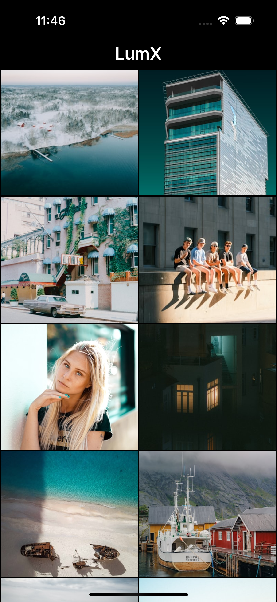

# LumX
LumX is a modular iOS app displaying high-quality images powered by the Unsplash API. Built with MVVM-C and Clean Architecture, it ensures scalability and maintainability through feature modules and Swift Package Manager (SPM).

## Tech Stack 🚀

- Architecture: MVVM-C + Clean Architecture

- UI: SwiftUI & UIKit

- Concurrency: ~~Combine~~ + async/await ~~(Swift Concurrency)~~

- Networking: URLSession

- Dependency Injection: [Factory](https://github.com/hmlongco/Factory)

- Modularization: Feature modules with SPM

## 🖼️ Screenshots
### 📸 Photo details

### 🏞️ Photo gallery

## Demo 🎬

